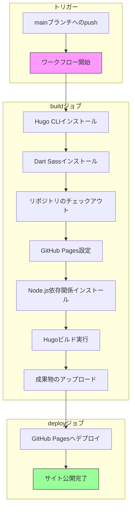

## Profile

ソフトウェアエンジニア

## 本サイトを支える技術

Static Site Generator:[Hugo](https://gohugo.io/)

Hugo Theme:[Hugo PaperMod](https://github.com/adityatelange/hugo-PaperMod)

Hosting Service:[GitHub Pages](https://docs.github.com/ja/pages)

### 仕組み

#### GitHub ActionsによるHugoのデプロイフロー

[.github/workflows/hugo.yaml](https://github.com/kengoma/kngm-tech-note/blob/main/.github/workflows/hugo.yaml)の図解

[参考](https://gohugo.io/hosting-and-deployment/hosting-on-github/)

## 免責事項

- 当サイトからのリンクやバナーなどで移動したサイトで提供される情報、サービス等について一切の責任を負いません。
- 当サイトのコンテンツ・情報について、正確性や安全性を保証するものではありません。情報が古くなっている可能性があります。
- 当サイトに掲載された内容によって生じた損害等の一切の責任を負いかねます。
- 本免責事項および、当サイトに記載されている情報は予告なしに変更、削除することがあります。あらかじめご了承下さい。