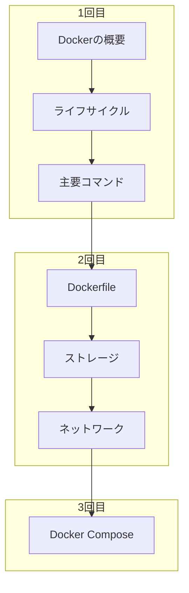

## 学習の目的

アプリケーション開発に必要なDockerの基本的操作を身につける

- Dockerのコマンドやライフサイクルを理解する
- `Docker Compose`を使い、ローカル環境にて複数コンテナを扱えるようになる
  - 段階的に学ぶことにより`compose.yaml`の記述内容が理解できるようになる

### 学習の全体像

※3回に分けて学ぶのが良さそう



### 取り扱わないこと

- DockerイメージのOSやソフトウェアに関する詳細な説明(Ubuntu,nginx...)
- プロダクション環境に関すること
  - セキュリティ
  - デプロイ

### 必要なソフトウェア

[Docker Desktop](https://www.docker.com/ja-jp/products/docker-desktop/)

#### インストール

[Docker Desktop のインストール](https://docs.docker.jp/desktop/install.html)

ターミナルからDockerコマンドが実行できることを確認する

```bash
docker --version
```
