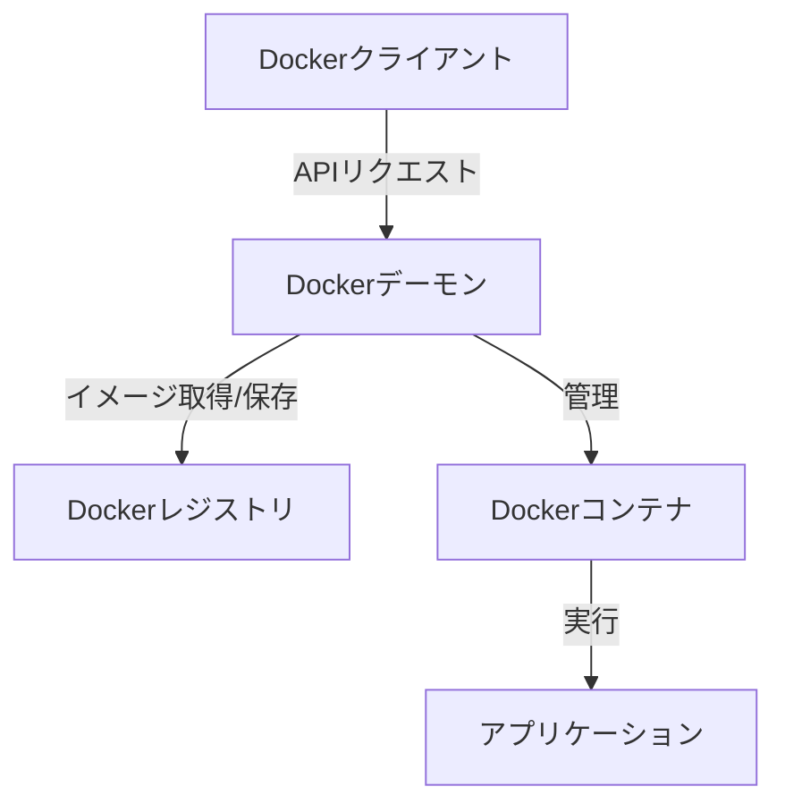

## Dockerとは

Dockerは、アプリケーションとその実行に必要な依存関係を含むコンテナを作成、配布、実行するためのオープンソースのプラットフォーム

### 主な特徴

1. **コンテナ化**
   - アプリケーションと依存関係を1つのパッケージにまとめる
   - 異なる環境でも一貫した動作を保証

2. **軽量性**
   - ホストOSのカーネルを共有
   - 仮想マシンより少ないリソースで動作

3. **移植性**
   - どの環境でも同じように動作
   - 開発環境と本番環境の差異を解消

### アーキテクチャ

### 主要コンポーネント

1. **Dockerデーモン**
   - コンテナのライフサイクル管理
   - イメージの構築と管理
   - ネットワークとストレージの管理

2. **Dockerクライアント**
   - CLIツール（docker command）
   - デーモンとの対話インターフェース

3. **Dockerレジストリ**
   - イメージの保存と配布
   - Docker Hub（パブリックレジストリ）
   - プライベートレジストリの構築も可能

### 利点

- **環境の一貫性**: 開発、テスト、本番で同じ環境を保証
- **迅速なデプロイ**: コンテナの起動が高速
- **スケーラビリティ**: 必要に応じて容易にスケールアップ/ダウン
- **バージョン管理**: イメージのバージョン管理が容易
