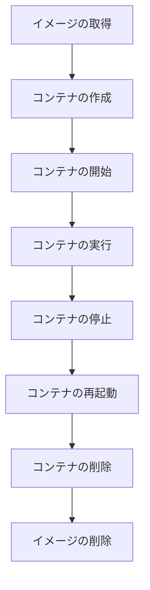
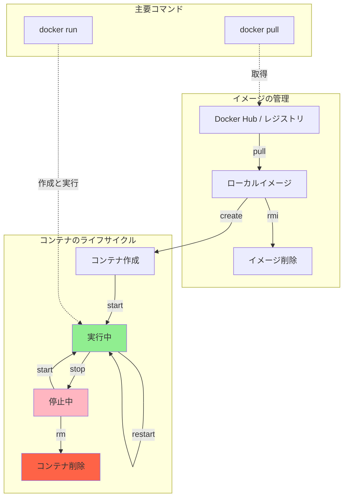

## hello-world

Docker公式のコンテナを実行する

```sh
docker run hello-world
```

このコンテナは正常に動作していることを確認するためのコンテナなので、メッセージを出力すると終了する

```bash
Unable to find image 'hello-world:latest' locally
latest: Pulling from library/hello-world
c9c5fd25a1bd: Download complete 
Digest: sha256:e0b569a5163a5e6be84e210a2587e7d447e08f87a0e90798363fa44a0464a1e8
Status: Downloaded newer image for hello-world:latest

Hello from Docker!
This message shows that your installation appears to be working correctly.

To generate this message, Docker took the following steps:
 1. The Docker client contacted the Docker daemon.
 2. The Docker daemon pulled the "hello-world" image from the Docker Hub.
    (arm64v8)
 3. The Docker daemon created a new container from that image which runs the
    executable that produces the output you are currently reading.
 4. The Docker daemon streamed that output to the Docker client, which sent it
    to your terminal.

To try something more ambitious, you can run an Ubuntu container with:
 $ docker run -it ubuntu bash

Share images, automate workflows, and more with a free Docker ID:
 https://hub.docker.com/

For more examples and ideas, visit:
 https://docs.docker.com/get-started/
```

## ライフサイクル

主な一連のステップは下記の図になる



## Dockerコマンド

※`<image-name>`は`ubuntu`を使用する

[Ubuntu](https://www.ubuntulinux.jp/ubuntu)

### 一覧の表示

#### イメージ

```sh
docker images
```

#### コンテナ

- `-a`オプションで起動していないコンテナも表示する

```bash
docker ps -a
```

### イメージの取得

```sh
docker pull <image-name>
```

### コンテナの作成

```sh
docker create <image-name>
```

### コンテナの開始

```sh
docker start <container-id>
```

### コンテナの実行

- コンテナの作成と同時に実行

```sh
docker run <image-name>
```

### コンテナの停止

```sh
docker stop <container-id>
```

### コンテナの再起動

```sh
docker restart <container-id>
```

### コンテナの削除

- 削除前に停止する必要がある

```sh
docker rm <container-id>
```

### イメージの削除

```sh
docker rmi <image-name>
```

### 図解


