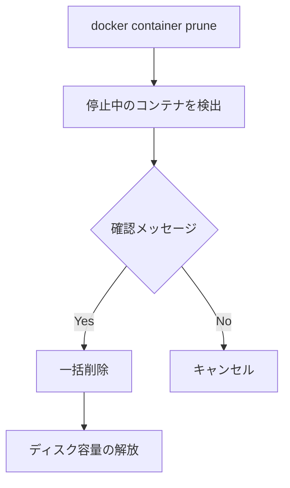

## コンテナに任意の名前をつける

コンテナに名前をつけることで、コンテナIDの代わりに分かりやすい名前で操作できる

### `--name`オプション

```sh
docker run --name <name> <image-name>
```

使用例：

```sh
# ubuntuコンテナに'my-ubuntu'という名前をつける
docker run --name my-ubuntu ubuntu

# 名前付きコンテナの起動
docker start my-ubuntu

# 名前付きコンテナの停止
docker stop my-ubuntu

# 名前付きコンテナの削除
docker rm my-ubuntu
```

### 名前の制約

- 一意の名前である必要がある
- 英数字、アンダースコア(_)、ハイフン(-)、ドット(.)が使用可能
- 最初の文字は英数字である必要がある

### 注意点

- 同じ名前のコンテナは作成できない
- 削除したコンテナの名前は再利用可能
- コンテナ作成後に名前の変更はできない

## コンテナ停止時に自動的に削除する

### `--rm`オプション

```sh
docker run --rm <image-name>
```

使用例：

```sh
# コンテナ停止時に自動削除するUbuntuコンテナを実行
docker run --rm hello-world
```

## 停止したコンテナを一括削除する

停止中のコンテナをまとめて削除するためのコマンド

### `docker container prune`コマンド

```sh
# 停止中のコンテナをすべて削除
docker container prune

# 確認なしで削除する場合
docker container prune -f
```

### フィルタを使用した削除

```sh
# 24時間以上前に作成された停止コンテナを削除
docker container prune --filter "until=24h"
```

### 代替コマンド

```sh
# psコマンドとrmコマンドを組み合わせた方法
docker rm $(docker ps -aq -f status=exited)
```

### コンテナ削除の注意点

- 削除したコンテナは復元できない
- 実行中のコンテナは削除されない
- ボリュームやネットワークは削除されない


