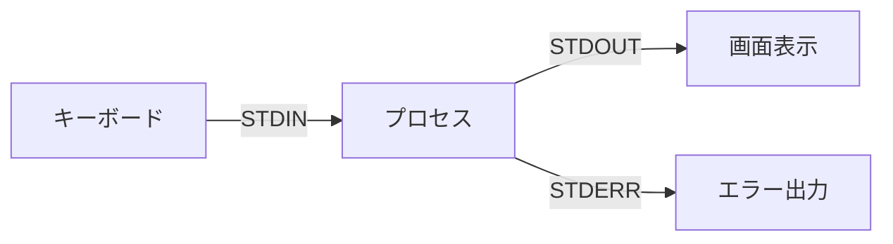
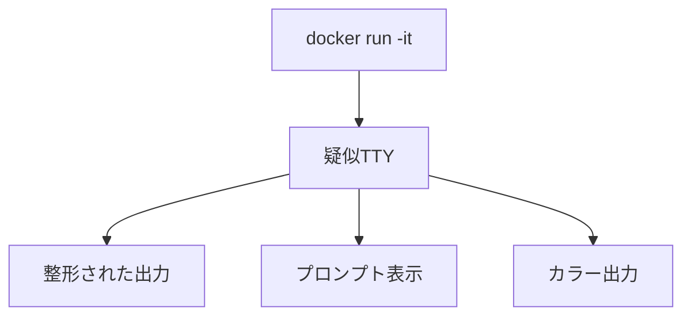
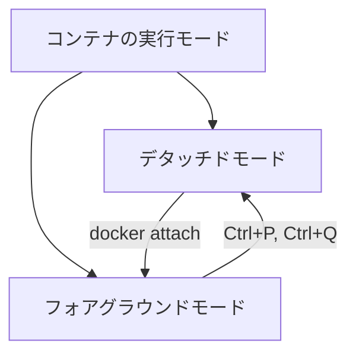

## コンテナへ接続して操作する

### bashを使用して操作する

```sh
docker run -it ubuntu
```

コンテナへ接続状態となり操作できるようになる

- `exit`でターミナルに戻る

```sh
root@c1e9f01b8e74:/#

root@c1e9f01b8e74:/# ls
bin  boot  dev  etc  home  lib  media  mnt  opt  proc  root  run  sbin  srv  sys  tmp  usr  var

root@c1e9f01b8e74:/# exit
exit

```

#### 補足：`ubuntu`イメージのデフォルトcmdについて

下記コマンドでイメージの詳細を確認すると、bashを実行するようになっている

```bash
docker inspect ubuntu
```

### `-it`オプション

#### このオプションは対話的な操作が必要な場合に重要で、特にシェルを使用する場合に必須

- `-i`と`-t`をまとめて実行している
- `-it`と組み合わせて使用するのが一般的

#### `-i`オプション

インタラクティブモード（interactive）を有効にするオプション

- 標準入力（STDIN）をオープンに保つ
- コンテナ内でコマンドの入力を可能にする
- シェルに対して入力できる状態を維持する

#### 標準入力（STDIN）とは

プログラムにデータを入力するための基本的な入力ストリーム

1. **基本的な特徴**
   - キーボードからの入力を受け付ける
   - プログラムへのデータ入力の標準的な方法

2. **Dockerでの利用**
   - コンテナ内のプロセスとの対話的な通信を可能にする
   - シェルコマンドの入力
   - スクリプトやコマンドへのパラメータ入力

3. **関連するストリーム**
   - 標準出力（STDOUT）: プログラムからの通常の出力
   - 標準エラー（STDERR）: エラーメッセージの出力



#### `-t`オプション

疑似ターミナル（pseudo-TTY）を割り当てる

1. **基本的な機能**
   - 仮想的なターミナル環境を提供
   - コマンドラインの表示を整形
   - プロンプトの表示を可能にする
   - カラー出力のサポート

2. **主な利点**
   - インタラクティブなシェル操作が可能
   - コマンド履歴の利用
   - タブ補完の使用
   - カーソルキーによる編集

3. **注意点**
   - 通常は`-i`オプションと併用
   - バッチ処理や自動化スクリプトでは不要
   - CI/CDパイプラインでは使用しない方が良い



### デタッチドとフォアグラウンド

コンテナの実行モードには、デタッチドモード（バックグラウンド）とフォアグラウンドモードの2種類がある

#### デタッチドモード（バックグラウンド実行）

- `-d`オプションを使用
- コンテナをバックグラウンドで実行
- ターミナルは即座に制御を取り戻す

```sh
# デタッチドモードでnginxを実行
docker run -p 80:80 -d nginx
```

#### フォアグラウンドモード

- デフォルトの実行モード
- コンテナの出力をそのまま表示
- Ctrl+Cで停止可能

```sh
# フォアグラウンドモードでnginxを実行
docker run nginx
```

#### モードの切り替え

```sh
# 実行中のコンテナをデタッチ
# Ctrl+P, Ctrl+Q

# デタッチドコンテナにアタッチ
docker attach <container-id>
```



#### 使い分けの指針

##### デタッチド

- 長時間実行するサービス
- バックグラウンドプロセス
- デーモン系アプリケーション

##### フォアグラウンド

- 対話的な操作が必要な場合
- デバッグ作業
- ログの直接確認
